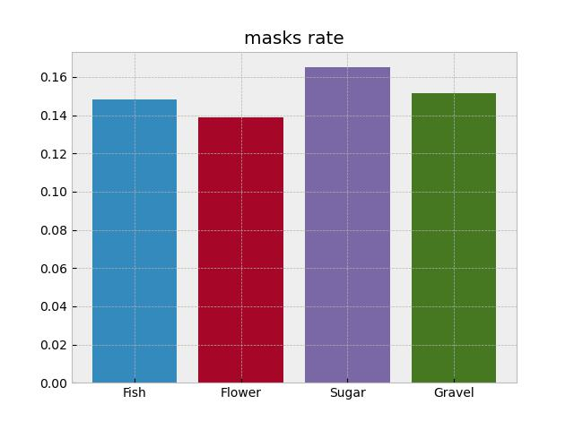
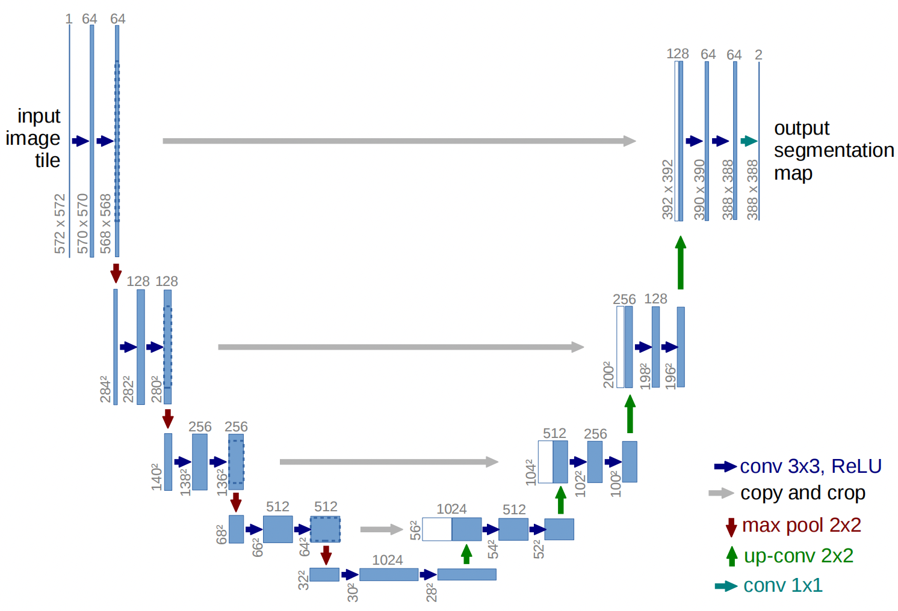
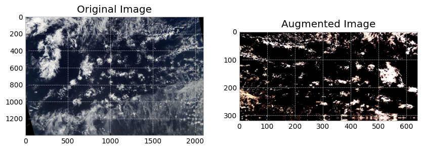
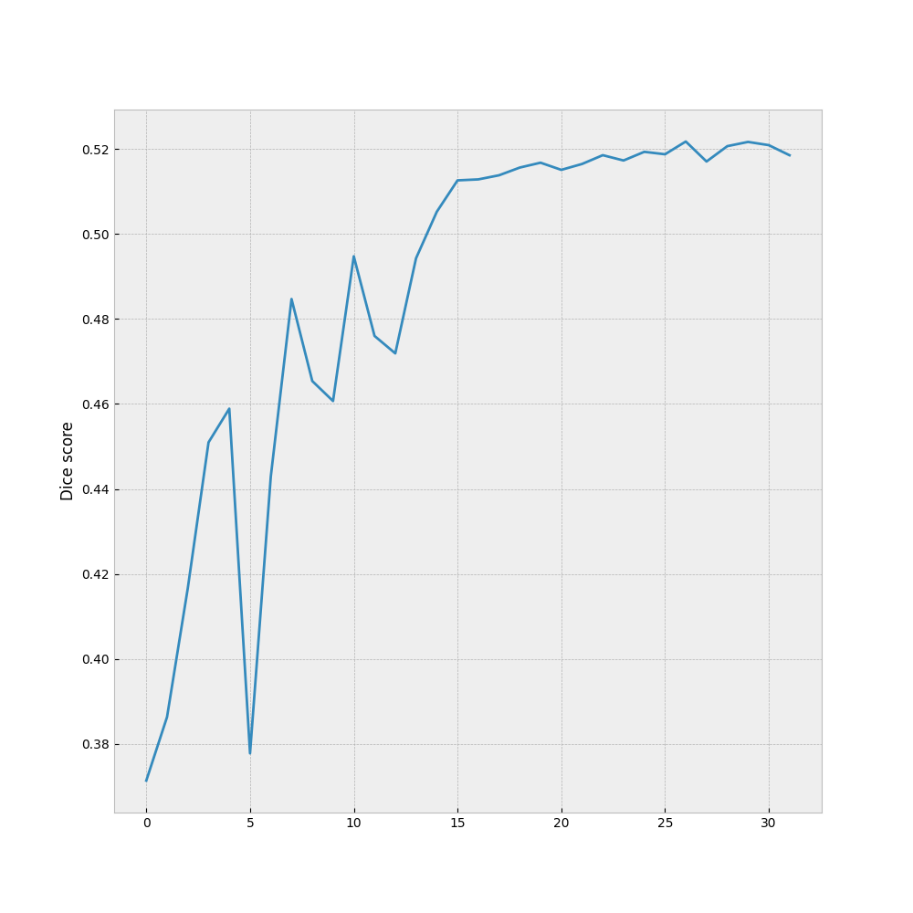
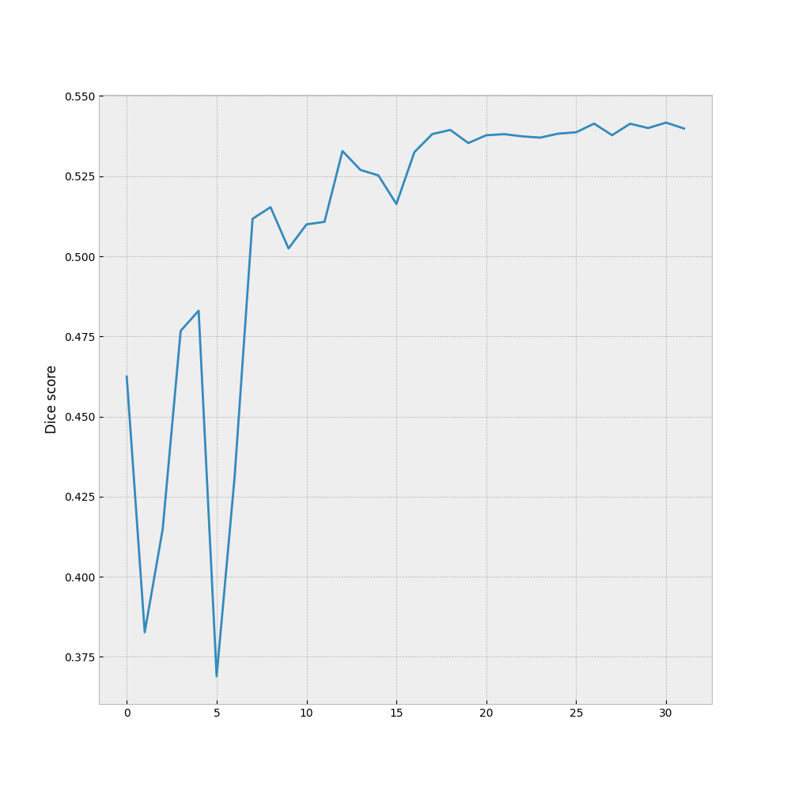

# Understanding Cloud Organization

## Contributors

- [Liyuan Geng](mailto:lg3490@nyu.edu)
- [Wenbo Lu](mailto:wl2707@nyu.edu)
- [Yishan Chen](mailto:yc5046@nyu.edu)

## Abstract

Clouds significantly influence the Earth's climate. Our project aims to classify cloud organizations accurately to enhance understanding of their impact on future climates. We address the challenge of the complex nature and indistinct boundaries of cloud types by implementing and comparing two models: U-net and PSPNet. Our findings suggest that PSPNet slightly outperforms the U-net model.

## Introduction

Accurate classification of cloud types is crucial for enhancing our understanding of cloud mechanisms and improving climate projection models. Our project leverages satellite images labeled into four categories: Fish, Flower, Gravel, and Sugar, aiming to segment these regions accurately using machine learning models.

## Dataset Description

The dataset, provided by Max Planck Institute for Meteorology and hosted on Kaggle, includes 5546 images categorized into four types of cloud formations. The `train.csv` file contains run-length encoded masks, and the `train_images` folder holds the corresponding JPG images.

### Statistical Analysis

Key metrics for each cloud category were analyzed, including mask rate, mask size rate, and figure with object rate.




## Models

- **Baseline Model (U-net):** Initial model using a standard U-net architecture for segmentation.

- **PSPNet:** An advanced model employing a Pyramid Scene Parsing Network to potentially enhance segmentation performance through global contextual awareness.


## Methodology

### Data Preprocessing
Images are resized and normalized to feed into the models. The ground truth is derived from RLE-encoded masks.

### Model Training
Both models are trained on the dataset with specific augmentations like horizontal flips and rotations to improve robustness and generalization.



### Evaluation
Model performance is evaluated using the Dice Coefficient during validation and testing phases.

## Results

PSPNet demonstrated superior performance over U-net, which aligns with our expectations given its advanced capabilities in handling global contextual information.

### Validation Results

- **U-net**
  - **Training Loss and Validation Loss**:
  
  - **Dice Score**:
  

- **PSPNet**
  - **Training Loss and Validation Loss**:
  
  - **Dice Score**:
  
    

### Test Results Comparison

| Model  | Dice Score       | Test Loss        |
|--------|------------------|------------------|
| U-net  | 0.4676           | 0.9650           |
| PSPNet | 0.4929           | 0.9044           |

- 

## Installation

To run this project, you will need Python 3.8+ and the following libraries:
- PyTorch
- torchvision
- OpenCV
- NumPy
- Matplotlib
- tqdm
- albumentations

Install the required packages using pip:

```bash
pip install torch torchvision numpy opencv-python matplotlib tqdm albumentations
```

## Usage

To train and evaluate the model, use the following command:

```bash
python main.py
```

## Repository Layout

- `models/`: Contains the scripts for U-net and PSPNet models.
- `utils.py`: Utility functions for data handling and augmentation.
- `loss.py`: Implementation of loss functions used in training the models.
- `optimizer.py`: Optimizer configurations.
- `main.py`: Main script to run the training and evaluation of models.
- `cloudSet.py`: Dataset preparation and augmentation scripts.
- `README.md`: Documentation of the project.
- `LICENSE`: Licensing information.

## License

This project is licensed under the MIT License - see the LICENSE file for details.
